# Pitch Final Optimizado: Casandra (Máx. 2 Minutos)

> **Duración Objetivo:** 2 minutos (120 segundos)
> **Tracks:** General Track (Crecimiento) + WDK Track (Tether - Compilación WDK CLI/MCP).

---

## Distribución de Tiempos (120 segundos)

```mermaid
gantt
    title Estructura del Video (120 segundos)
    dateFormat  X
    axisFormat %s
    
    Problemática (Gancho)       :active, p1, 0, 20
    Solución (Casandra)         :p2, after p1, 20s
    Demostración Web & MCP Core  :p3, after p2, 45s
    Negocio y Escalabilidad     :p4, after p3, 15s
    Integración WDK & Cierre    :p5, after p4, 20s
```

---

## Guion de Voz (Texto para memorizar o leer dinámicamente)

### 1. La Problemática (0:00 - 0:20 | 20s)
> *"¿Le confiarías tu dinero a una Inteligencia Artificial que inventa datos para justificar sus acciones? Los agentes autónomos actuales alucinan: leen noticias 'a ojo', inventan precios y operan sobre cajas negras. En Web3, donde cada transacción es irreversible, esto es sumamente peligroso."*

### 4. La Solución (0:20 - 0:40 | 20s)
> *"Para resolverlo, creamos **Casandra**: un sustrato de decisión que provee un **Evidence Pack** determinista y fechado en JSON. Casandra no predice ni ejecuta por sí sola; le da al agente los datos puros y verídicos (precios, riesgo matemático, Fear & Greed y noticias reales) para que **el agente decida por sí mismo**."*

### 3. Demo Web y MCP Core (0:40 - 1:25 | 45s)
*(Muestra la web en vivo o la respuesta JSON de Cursor)*
> *"El núcleo de Casandra es `get_market_pulse` en nuestro servidor MCP. Al consultarlo, la IA recibe bajo el algoritmo `casandra-pulse-v1` un porqué (`why`) detallado y más de 3 razones con números concretos sobre el estado del mercado. Además, para máxima transparencia, guardamos snapshots de riesgo en el contrato `CasandraRegistry` desplegado en **Ethereum Sepolia**."*

### 4. Modelo de Negocio y Escalabilidad (1:25 - 1:40 | 15s)
> *"Monetizamos mediante un esquema **Pay-per-Query (pago por consulta)** SaaS para desarrolladores de agentes. Es infinitamente escalable: hoy cubrimos BTC y ETH, pero el motor está diseñado para incorporar acciones tradicionales y materias primas fácilmente."*

### 5. Tether WDK y Cierre (1:40 - 2:00 | 20s)
*(Muestra el comando `check_wdk_guardrail` o código WDK)*
> *"Nos postulamos al **General Track** y al **WDK Track**. Con el SDK de Tether, si la IA decide actuar tras ver la evidencia, pasa por nuestro guardarraíl (`check_wdk_guardrail`) y ejecuta un envío en USD₮ simulado (`dryRun: true`). Casandra informa, el agente decide y WDK ejecuta de forma segura. Muchas gracias."*
