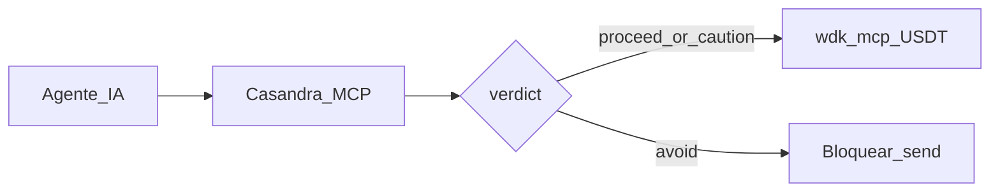

# Aleph Hackathon 2026 — Track decision (Casandra)

**Fuentes oficiales (Hacki):**

| Track | URL |
|-------|-----|
| Home | https://hacki.crecimiento.build/h/aleph-hackathon-2026 |
| **General** (default) | https://hacki.crecimiento.build/h/aleph-hackathon-2026/tracks/general-track |
| **WDK** (sponsor elegido) | https://hacki.crecimiento.build/h/aleph-hackathon-2026/tracks/wdk-track |
| QVAC | https://hacki.crecimiento.build/h/aleph-hackathon-2026/tracks/qvac-track |
| Pears | https://hacki.crecimiento.build/h/aleph-hackathon-2026/tracks/pears-track |
| Event | https://alephhackathon.crecimiento.build/ |

---

## Regla Hacki (cómo se elige)

| Capa | Qué hacemos |
|------|-------------|
| **General** | Se participa **por defecto** (best overall; incluye proyectos AI/MCP) |
| **Track sponsor** | Se escoge **uno más** → **WDK** |
| **No elegidos** | QVAC · Pears |

**Equipos:** 1–4 miembros.

---

## Decisión del equipo

| Capa | Decisión |
|------|----------|
| Default | **General** |
| Sponsor | **[WDK Track 1](https://hacki.crecimiento.build/h/aleph-hackathon-2026/tracks/wdk-track)** — CLI / `wdk-mcp` |
| Producto | Oráculo Casandra MCP + wallet WDK bajo **guardrails de riesgo** (`verdict`) |

### Historia (General + WDK)

1. Agente llama Casandra → `get_risk_level` / portfolio → `verdict`
2. Si `proceed` o `caution` → puede usar **wdk-mcp** (balance / send USD₮)
3. Si `avoid` → **no** ejecuta send

### Por qué WDK (no QVAC / Pears)

| Track | Fit | Motivo |
|-------|-----|--------|
| **WDK** | Mejor | USDT ya en producto; ejemplo oficial #1 = agente con wallet + guardrails |
| QVAC | Bajo | Exige inferencia 100% local `@qvac/sdk` |
| Pears | Bajo | Exige `pear install` + OTA P2P |

### Qué NO cuenta para WDK (descarte)

- Solo USDT en la fórmula de riesgo
- Contrato Base sin `@tetherto/wdk`
- Bolt-on sin uso en el demo

---

## Criterios General (demo/video)

| Criterion | Proof Casandra |
|-----------|----------------|
| Technicality | MCP + market-core + WDK guardrail + registry opcional |
| Originality | Agentes alucinan → JSON timestamped + send gated |
| UI/UX/DX | Gauge web + dual MCP config (Casandra + WDK) |
| Practicality | Portfolio / risk / USD₮ ballast + wallet tools |
| Presentation | Video: problema → gauge → verdict → WDK → disclaimer |

## Deadline

Sun 23 Aug ~11:00 BO (Hacki 12:00 ARG).

## Checklist submit

- [ ] DoraHacks/Hacki: **General** (default) + marcar **WDK**
- [ ] Video ≤3 min muestra loop Casandra → WDK
- [ ] Repo + README con packages WDK + permalinks
- [ ] Deploy URL + contract address si #10 green
- [ ] `.env.example` WDK; wallet de prueba dedicada

Integración: [docs/WDK.md](WDK.md) · Direction: [DIRECTION.md](DIRECTION.md)
