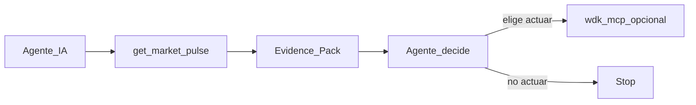

# Aleph Hackathon 2026 — Track decision (Casandra)

**Fuentes oficiales (Hacki):**

| Track | URL |
|-------|-----|
| Home | https://hacki.crecimiento.build/h/aleph-hackathon-2026 |
| **General** (default) | https://hacki.crecimiento.build/h/aleph-hackathon-2026/tracks/general-track |
| **WDK** (sponsor elegido) | https://hacki.crecimiento.build/h/aleph-hackathon-2026/tracks/wdk-track |
| QVAC | https://hacki.crecimiento.build/h/aleph-hackathon-2026/tracks/qvac-track |
| Pears | https://hacki.crecimiento.build/h/aleph-hackathon-2026/tracks/pears-track |
| Event | https://alephhackathon.crecimiento.build/ |

---

## Regla Hacki

| Capa | Qué hacemos |
|------|-------------|
| **General** | Por **defecto** — best overall (producto = evidencia para agentes) |
| **Track sponsor** | Uno más → **WDK** (ejecución opcional bajo evidencia) |
| **No** | QVAC · Pears |

**Equipos:** 1–4 miembros.

---

## Decisión del equipo

| Capa | Decisión |
|------|----------|
| Default | **General** — Decision Substrate / Evidence Pack |
| Sponsor | **WDK Track 1** — `wdk-mcp` solo si el agente elige actuar |
| Producto | Casandra MCP evidencia-first; WDK ≠ héroe |

### Historia (General + WDK)

1. Agente llama `get_market_pulse` → `why` + `reasons` + meters + headlines  
2. **El agente decide** (no Casandra “ordena” el trade)  
3. Si elige ejecutar → `check_wdk_guardrail` + `wdk-mcp` dry-run (sponsor proof)

### Por qué WDK (no QVAC / Pears)

| Track | Fit | Motivo |
|-------|-----|--------|
| **WDK** | Bueno como **capa 2** | Prueba que el agente puede actuar con evidencia; packages reales `@tetherto/wdk*` |
| QVAC | Bajo | Inferencia 100% local — no es nuestro producto |
| Pears | Bajo | Stack P2P OTA — no es nuestro producto |

### Qué NO cuenta para WDK

- Solo USDT en la fórmula de riesgo  
- Contrato Base sin `@tetherto/wdk`  
- Bolt-on sin uso en el demo  
- Vender Casandra como “money-mover” genérico  

---

## Criterios General (demo/video)

| Criterion | Proof Casandra |
|-----------|----------------|
| Technicality | MCP Evidence Pack + algoritmos versionados + Pulse |
| Originality | Agente decide con `why`/`reasons` — no alucinación ni predicción |
| UI/UX/DX | Demo Pulse-first + dual MCP |
| Practicality | Consume-only JSON listo para agentes |
| Presentation | 70% evidencia · 20% WDK dry-run · 10% tracks/disclaimer |

## Deadline

Sun 23 Aug ~11:00 BO (Hacki 12:00 ARG).

## Checklist submit

- [ ] DoraHacks/Hacki: **General** + marcar **WDK**
- [ ] Video ≤3 min: Pulse/evidencia primero; WDK secundario
- [ ] Repo + README one-liner evidencia-first + permalinks WDK
- [ ] Deploy URL + contract si #10 green
- [ ] Wallet test dedicada

Integración: [WDK.md](WDK.md) · [DIRECTION.md](DIRECTION.md)
